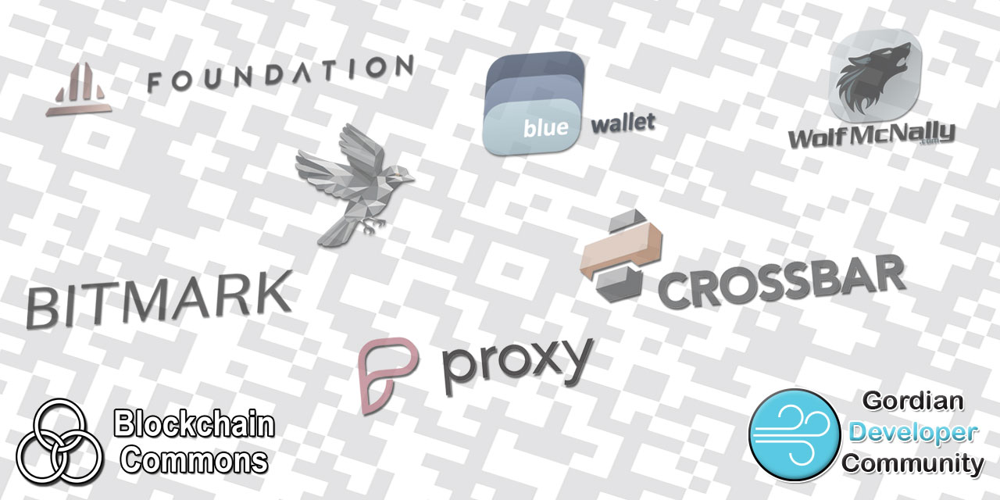

# Gordian Developer Community

## Mission

**Gordian Developer Community** is a community of cryptocurrency & identity wallet developers, sharing best practices for paritioned interoperability among multiple vendors on multiple platforms. These best practices include support for hot, cold and multisig cryptographic wallets, research & proposals for data formats and protocols, usage of gaps such as airgaps and torgaps, security and UX for multisig work flows, and other key management and signing issues and topics, particularly those that support the [Gordian Principles](https://github.com/BlockchainCommons/Gordian#gordian-principles) of independence, privacy, resilience, and openness.

## Meetings

Much of our collaborative work is conducted through Meetings. Please sign up for our [Gordian Developer lists](https://www.blockchaincommons.com/subscribe.html) to be informed of when they occur and please see our [meetings page](/meetings/README.md) for info from meetings to date.

## URs

One of our most successful interoperable specifications to date has been `ur:`. Following is a table of usage. 

_Please submit PRs if you are aware of different usages or to make corrections._

| Publisher | Wallet | Animated PSBT | ur:crypto-psbt | ur:crypto-* | Future |
| ---------- | ---- | --------- | -------------- | --------------------------------------------------------- | --- |
| BlueWallet | BlueWallet | ? | ? | bc-urv1 |
| Casa | Casa&nbsp;Wallet | YES | YES | -hdkey (-request/response for health check) |
| Cobo | Cobo&Wallet; | ? | ? | bc-urv1 |
| DIYBitcoin | DIY&nbsp;Hardware&nbsp;Wallet | YES | ? | ? |
| Denton&nbsp;Development| Fully Noded | YES | YES | ? |
| Blockstream | Jade | YES | ? | ? |
| Keeper | Keeper&nbsp;Wallet | YES | YES | -account |
| Keystone | Keystone&nbsp;Essential/Pro | YES | YES | ? |
| Foundation | Passport | YES | YES | (-request/response with Casa for health check) | -account
| Meteor Software| SeedSigner | YES | ? | ? |
| Blockchain&nbsp;Commons | SeedTool | YES | YES | -account, -address, -bip39, -hdkey -output, -seed, -sskr |
| Craig Raw | Sparrow | YES | YES | -account, -address, -bip39, -hdkey, -output, -seed |

More info on PRs can be found in our [research papers](https://github.com/BlockchainCommons/Research/blob/master/papers/bcr-2020-005-ur.md) and in our [UR docs](https://github.com/BlockchainCommons/crypto-commons#urs).

## Discussions

The best place to talk about Blockchain Commons and its projects is in our GitHub Discussions areas.

[**Gordian Developer Community**](https://github.com/BlockchainCommons/Gordian-Developer-Community/discussions). For standards and open-source developers who want to talk about interoperable wallet specifications, please use the Discussions area of the [Gordian Developer Community repo](https://github.com/BlockchainCommons/Gordian-Developer-Community/discussions). This is where you talk about Gordian specifications such as [Gordian Envelope](https://github.com/BlockchainCommons/Gordian/tree/master/Envelope#articles), [bc-shamir](https://github.com/BlockchainCommons/bc-shamir), [Sharded Secret Key Reconstruction](https://github.com/BlockchainCommons/bc-sskr), and [bc-ur](https://github.com/BlockchainCommons/bc-ur) as well as the larger [Gordian Architecture](https://github.com/BlockchainCommons/Gordian/blob/master/Docs/Overview-Architecture.md), its [Principles](https://github.com/BlockchainCommons/Gordian#gordian-principles) of independence, privacy, resilience, and openness, and its macro-architectural ideas such as functional partition (including airgapping, the original name of this community).

We also have [a Signal group and a low-volume announcement mailing list](https://www.blockchaincommons.com/subscribe.html#gordian-developers).

## Members

* [Blockchain Commons](https://www.BlockchainCommons.com) (open source repos: [GitHub/BlockchainCommons](https://GitHub.com/BlockchainCommons) twitter: [@BlockchainComns](https://twitter.com/BlockchainComns) )
   * Wallets & Major Projects
     * [Gordian](https://github.com/BlockchainCommons/Gordian)(including [GordianServer-macOS](https://github.com/BlockchainCommons/GordianServer-macOS), [GordianWallet-iOS](https://github.com/BlockchainCommons/GordianWallet-iOS), [GordianSigner-Android](https://github.com/BlockchainCommons/GordianSigner-Android), [GordianSigner-Catalyst](https://github.com/BlockchainCommons/GordianSigner-Catalyst), and [GordianSigner-macOS](https://github.com/BlockchainCommons/GordianSigner-macOS))
     * [LetheKit](https://github.com/BlockchainCommons/bc-lethekit)
     * [#SmartCustody Book](https://github.com/BlockchainCommons/SmartCustodyBook)
     * [Learning Bitcoin from the Command Line Course](https://github.com/BlockchainCommons/Learning-Bitcoin-from-the-Command-Line)
   * People:
     * [Christopher Allen](mailto:ChristopherA@LifeWithAlacrity.com) (github: [@ChristopherA](https://github.com/christophera/) twitter: [@ChristopherA](https:twitter.com/ChristopherA) )
     * [Peter Denton](mailto:fontainedenton@googlemail.com ) (github: [@Fonta1n3](https://github.com/Fonta1n3/) twitter: [@Fonta1n3](https://twitter.com/Fonta1n3))
     * [Wolf McNally](mailto:wolf@wolfmcnally.com) (github: [@WolfMcNally](https://github.com/WolfMcNally/) twitter: [@WolfMcNally](https://twitter.com/WolfMcNally/))
     * \+ multiple interns and other contributors
* [Keystone](https://keyst.one/) (open source repos: [GitHub/Keystone](https://github.com/KeystoneHQ) twitter: [@KeystoneWallet](https://twitter.com/KeystoneWallet) )
   * Projects
     * [Keystone firmware](https://github.com/KeystoneHQ/Keystone-cold-app)
     * [Keystone BTC firmware](https://github.com/KeystoneHQ/Keystone-cold-app-btc)
     * [UR-Registry](https://github.com/KeystoneHQ/ur-registry)
   * People:
     * [Aaron Chen](mailto:aaron@keyst.one) (github: [@aaronisme](https://github.com/aaronisme/) twitter: [@Aaron Chen](https://twitter.com/aaron1sme) )
     * [Lixin Liu](mailto:lixin@keyst.one ) (twitter: [@BitcoinLixin](https://twitter.com/BitcoinLixin/))
     * [Sora Li](mailto:sora@keyst.one) (github: [@soralit](https://github.com/soralit/))
     * \+ multiple other contributors
* [Cobo Vault](https://www.cobo.com/hardware-wallet) (open source repos: [GitHub/CoboVault](https://GitHub.com/CoboVault) twitter: [@CoboVault](https://twitter.com/CoboVault) )
   * Products - Cobo Vault
     * [CoboVault Application](https://github.com/CoboVault/cobo-vault-cold)
     * [CoboVault SecureElement](https://github.com/CoboVault/cobo-vault-se-firmware)
     * [crypto-coin-kit](https://github.com/CoboVault/crypto-coin-kit)
* [Foundation Devices](https://foundationdevices.com) (open source repos: [GitHub/Foundation-Devices](http://github.com/Foundation-Devices) twitter: [@FOUNDATIONdvcs](https://twitter.com/FOUNDATIONdvcs) )
   * Projects
     * Passport (public repos coming this Fall)
     * [Python UR Library](https://github.com/Foundation-Devices/foundation-ur-py)
   * People:
     * [Ken Carpenter](mailto:ken@foundationdevices.com) (github: [@FoundationKen](https://github.com/FoundationKen/) twitter: [@KenOfFoundation](https://twitter.com/KenOfFoundation) )
     * [Zach Herbert](mailto:zach@foundationdevices.com ) (github: [@zachherbert](https://github.com/zachherbert/) twitter: [@zachherbert](https://twitter.com/zachherbert/) )
     * \+ interns and other contributors 
* [Sparrow Wallet](https://sparrowwallet.com) (open source repos: [GitHub/Sparrow Wallet](https://github.com/sparrowwallet) twitter: [@SparrowWallet](https://twitter.com/SparrowWallet) )
   * Projects
     * Sparrow Wallet (https://github.com/sparrowwallet/sparrow)
     * Hummingbird - Java UR library (https://github.com/sparrowwallet/hummingbird)
   * People:
     * [Craig Raw](mailto:mail@sparrowwallet.com) (github: [@craigraw](https://github.com/craigraw/) twitter: [@craigraw](https://twitter.com/craigraw) )

## Archived Info

The following folders in this repository contain other information:

* [Proof of Concept: 2019](PoC_2019/README.md) - In 2019 Blockchain Commons did a proof-of-concept of air-gapped signing between two airgapped devices, one written in Swift for iOS, the other using Java on macOS Desktop. Full code and information is available here.

## Status - Work in Progress

**Gordian Developer Community** is by definition a work-in-progress, as it contains active discussions among its members.

## Origin, Authors, Copyright & Licenses

Unless otherwise noted (either in this [/README.md](./README.md) or in the file's header comments) the contents of this repository are Copyright © 2020 by Blockchain Commons, LLC, and are [licensed](./LICENSE) under the [spdx:BSD-2-Clause Plus Patent License](https://spdx.org/licenses/BSD-2-Clause-Patent.html).

## Financial Support

**Gordian Developer Community** is a project of [Blockchain Commons](https://www.blockchaincommons.com/). We are proudly a "not-for-profit" social benefit corporation committed to open source & open development. Our work is funded entirely by donations and collaborative partnerships with people like you. Every contribution will be spent on building open tools, technologies, and techniques that sustain and advance blockchain and internet security infrastructure and promote an open web.

To financially support further development of `$projectname` and other projects, please consider becoming a Patron of Blockchain Commons through ongoing monthly patronage as a [GitHub Sponsor](https://github.com/sponsors/BlockchainCommons). You can also support Blockchain Commons with bitcoins at our [BTCPay Server](https://btcpay.blockchaincommons.com/).

## Contributing

We encourage public contributions through issues and pull requests! Please review [CONTRIBUTING.md](./CONTRIBUTING.md) for details on our development process. All contributions to this repository require a GPG signed [Contributor License Agreement](./CLA.md).

### Other Questions & Problems

As an open-source, open-development community, Blockchain Commons does not have the resources to provide direct support of our projects. Please consider the discussions area as a locale where you might get answers to questions. Alternatively, please use this repository's [issues](./issues) feature. Unfortunately, we can not make any promises on response time.

If your company requires support to use our projects, please feel free to contact us directly about options. We may be able to offer you a contract for support from one of our contributors, or we might be able to point you to another entity who can offer the contractual support that you need.

### Credits

Thank you to all our members and contributors!

## Responsible Disclosure

We want to keep all of our software safe for everyone. If you have discovered a security vulnerability, we appreciate your help in disclosing it to us in a responsible manner. We are unfortunately not able to offer bug bounties at this time.

We do ask that you offer us good faith and use best efforts not to leak information or harm any user, their data, or our developer community. Please give us a reasonable amount of time to fix the issue before you publish it. Do not defraud our users or us in the process of discovery. We promise not to bring legal action against researchers who point out a problem provided they do their best to follow the these guidelines.

### Reporting a Vulnerability

Please report suspected security vulnerabilities in private via email to ChristopherA@BlockchainCommons.com (do not use this email for support). Please do NOT create publicly viewable issues for suspected security vulnerabilities.

The following keys may be used to communicate sensitive information to developers:

| Name              | Fingerprint                                        |
| ----------------- | -------------------------------------------------- |
| Christopher Allen | FDFE 14A5 4ECB 30FC 5D22  74EF F8D3 6C91 3574 05ED |

You can import a key by running the following command with that individual’s fingerprint: `gpg --recv-keys "<fingerprint>"` Ensure that you put quotes around fingerprints that contain spaces.

